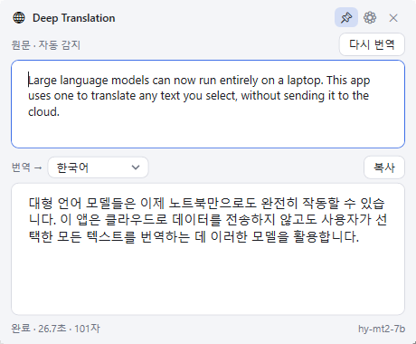
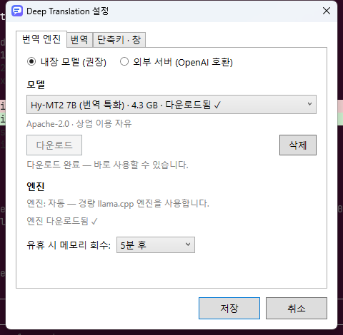

# Deep Translation

[English](../README.md) | **한국어**

텍스트를 선택하고 **Ctrl+C, C**(빠르게 두 번) — 어디서든 번역 팝업이 뜨는 Windows 번역기.
번역은 PC 안의 로컬 LLM이 하므로 텍스트가 인터넷으로 나가지 않습니다.

  
  

- 별도 프로그램 없이 동작. 모델은 설정에서 1회 다운로드
- 기본 **모든 언어 → 한국어**, 원문이 한국어면 → 영어 (팝업에서 바로 변경 가능)
- 결과가 실시간으로 스트리밍 표시. 원문을 고치면 자동으로 다시 번역
- 단축키 변경, 용어집, 라이트/다크 테마, Windows 시작 시 자동 실행
- 쓰지 않을 때(기본 5분)는 엔진을 내려 RAM/VRAM 회수
- LM Studio·Ollama 등 OpenAI 호환 서버로 전환 가능

## 설치

[Releases](https://github.com/Kyounghun384929/deep-translation/releases/latest)에서
`DeepTranslation-Setup-<버전>.exe`를 받아 실행합니다. 설치 없이 쓰려면 `DeepTranslation.exe`를 실행하면 됩니다.

코드 서명이 없어 SmartScreen 경고가 뜨면 **추가 정보 → 실행**을 누릅니다.

### 시스템 요구 사항

| | 최소 | 권장 |
|---|---|---|
| OS | Windows 10/11 x64 | Windows 11 x64 |
| RAM | 8 GB (1.5B 모델 기준) | 16 GB |
| GPU | 없어도 됨 (CPU 동작) | Vulkan 지원 GPU, VRAM 6 GB 이상 |
| 디스크 | 2 GB | 6 GB (7B 모델 여유분) |

GPU가 없어도 동작하지만 눈에 띄게 느립니다. 모델별 실행 중 필요 메모리(모델 파일 + 기본 8K 컨텍스트 기준 대략치):

| 모델 | 다운로드 | 실행 중 RAM/VRAM |
|---|---|---|
| HyperCLOVA X SEED 1.5B | 1.1 GB | 약 2 GB |
| EXAONE 3.5 2.4B | 1.6 GB | 약 2.5 GB |
| Qwen3 4B / Qwen3.5 4B | 2.5–2.7 GB | 약 4 GB |
| Hy-MT2 7B | 4.6 GB | 약 6 GB |
| Gemma 4 E4B | 5.0 GB | 약 6.5 GB |

## 시작하기

1. 트레이 아이콘 우클릭 → **설정** → 모델 **다운로드** (기본 Qwen3.5 4B, 2.7 GB)
2. 텍스트를 선택하고 **Ctrl+C, C**

첫 번역 때 번역 엔진(약 33 MB)을 자동으로 받습니다. GPU가 없으면 CPU로 동작합니다.

## 모델

모든 모델은 4비트 GGUF(Q4_K_M)로 실행됩니다. 설정 → 번역 엔진에서 고릅니다.

| 모델 | 이런 경우에 | 비고 |
|---|---|---|
| **Qwen3.5 4B** (기본) | 범용, 가장 넓은 언어 지원 | "201개 언어 및 방언" 지원 ([Qwen](https://huggingface.co/Qwen/Qwen3.5-4B)). Apache 2.0 |
| **Hy-MT2 7B** | 최고 번역 품질 | Tencent 번역 전용 모델, "33개 언어 간 번역" ([Hy-MT2](https://huggingface.co/tencent/Hy-MT2-7B)). Apache 2.0 |
| **Gemma 4 E4B** | 높은 범용 품질 | Google, "140개 이상 언어", 유효 파라미터 4.5B ([Gemma 4](https://huggingface.co/google/gemma-4-E4B-it)). Apache 2.0 |
| **Qwen3 4B Instruct** | Qwen3.5 대안 | 이전 세대 Qwen ([Qwen](https://huggingface.co/Qwen/Qwen3-4B-Instruct-2507)). Apache 2.0 |
| **EXAONE 3.5 2.4B** | 저사양 PC에서 한↔영 | LG AI연구원, "영어·한국어" 이중 언어 ([EXAONE](https://huggingface.co/LGAI-EXAONE/EXAONE-3.5-2.4B-Instruct)). **비상업 라이선스** |
| **HyperCLOVA X SEED 1.5B** | 최소 메모리, 한국어 중심 | NAVER, "한국어와 한국 문화"에 최적화 ([HyperCLOVA X](https://huggingface.co/naver-hyperclovax/HyperCLOVAX-SEED-Text-Instruct-1.5B)). 자체 라이선스로 상업 이용 가능 |

라이선스 조건은 설정 창에도 표시됩니다. 상업적으로 쓰기 전에 확인하세요.

## 사용법

| 동작 | 방법 |
|---|---|
| 번역 | 텍스트 선택 후 **Ctrl+C, C** (설정에서 변경 가능) |
| 대상 언어 변경 | 팝업의 "번역 →" 드롭다운 |
| 다시 번역 | 원문 수정, 또는 **Ctrl+Enter** |
| 번역문 복사 | **복사** 버튼 |
| 창 닫기 | **Esc** 또는 창 밖 클릭 (📌 고정 시 유지) |
| 직접 입력 번역 | 트레이 아이콘 더블클릭 |
| 용어집 | 설정 → 용어집에 `원어 = 번역어` 한 줄씩 |
| 업데이트 | 하루 1회 자동 확인, 또는 트레이 우클릭 → **업데이트 확인** |

## 외부 서버 연동

설정에서 엔진을 **외부 서버 (OpenAI 호환)**로 바꾸면 직접 띄운 서버를 쓸 수 있습니다.

| 서버 | 주소 |
|---|---|
| [LM Studio](https://lmstudio.ai/) | `http://localhost:1234` |
| [Ollama](https://ollama.com/) | `http://localhost:11434/v1` |
| llama.cpp · vLLM 등 | 기동 시 지정한 주소 |

인증이 필요한 서버는 설정의 **API 키** 란에 입력합니다.

## 알려진 문제

| 증상 | 설명 |
|---|---|
| "내장 번역 엔진을 시작하지 못했습니다" | 대개 메모리 부족. 더 작은 모델 선택 |
| "번역 서버에 연결할 수 없습니다" | LM Studio 등 외부 서버 실행 여부와 주소·API 키 확인 |
| 번역이 느림 | 첫 요청은 모델 로드로 오래 걸림. 계속 느리면 더 작은 모델 또는 GPU 사용 |
| 스마트 앱 컨트롤(SAC)이 켜진 PC | 자동으로 서명된 Ollama 엔진을 사용. 설정에서 llama.cpp를 강제하면 차단됨 |

설정 파일: `%APPDATA%\DeepTranslation\settings.json`
모델 파일: `%LOCALAPPDATA%\DeepTranslation\models`
